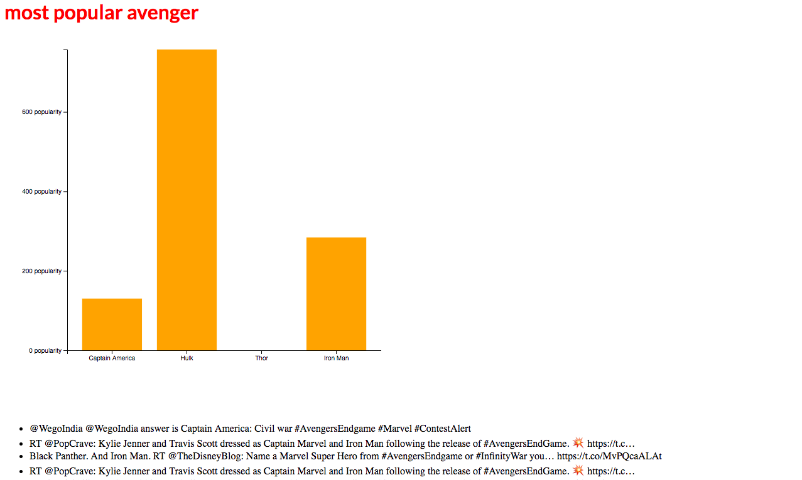
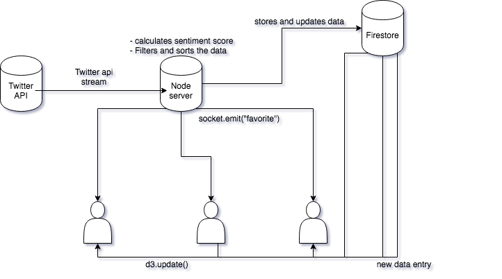

# Real time web


## My Concept
My concept consists of visualizing the most favourable characters of the upcoming movie _Avengers: Endgame_.
Based on a twitter stream based on #avengersendgame, my application will measure positive about certain characters in the film. When a character gets a sentiment score, this score will be added in the database. From the database the barchart will get a live update and re-renders itself. Users can also click which character is their favorite. All of the other clients will get an notification that someone has clicked on a favorite.

## The Api
I'm using the Twitter api. For setting up a live twitter stream I will make use of [Twit]("https://www.npmjs.com/package/twit"). To connect to the Twitter api. To analyze the tweets based on negative mentions or positive mentions,I will make use of [Sentiment]("https://www.npmjs.com/package/sentiment"). Sentiment uses natural language processing, text analyses and emoji ranking to decide wether a tweet is negative or positive.

There are multiple ways in which you can retrieve data from the twitter Api. For example, you can make some simple fetch requests to the api. I'm making use of the streaming capabilities of the api. The standard way of fetching data to the api has a rate limit. By streaming the data from the api, it will give me two advantages:
1. There is almost no rate limit. The rate limit for the streaming api is roughly 60 tweets per second.
2. It will give me more acces to realtime data.

### Data model


## Datamodel
When I recieve the data fromt the Twitter api, I want to strip it from data I don't need before my code does anything further. So this is the object I want to recieve and work with in my code.

```javascript
let tweet = {
    body: stream.text,
    id: stream.id,
    screenname: stream.user.screen_name,
    date: stream.created_at,
    sentiment: sentiment.analyze(stream.text)
}
```

When I get the sentiment score that I need, I want to store that number in the firestore database. First I read this object from the database when we, for instance, want to increment the score of Iron Man. First I have to read the score before I can increment something.

```javascript
let hero = {
    _id = '1puHeTa2McEWkM9VqT4l'
    name = 'Iron Man'
    score = 340
}
```
When we have this we can increment the score by update the doc

```javascript
    let heroObj = doc.data()
    let Score = heroObj.score + tweet.sentiment.score
    let updateSingle = heroRef.update({ score: Score });
```

## Firestore and Socket.io
Firestore has a function in which I can listen to documents that are being updated in the database.
I choose to use this because I wanted to try out Firestore. But most important; I wanted to experiment with the real-time api functionalities. The combination of Firestore and Socket.io is really powerful I think. The sockets can work for smaller interactions on the page for all of the clients. Let firestore do the data lifting.

## Sources
[circular drag D3](https://www.d3-graph-gallery.com/graph/circularpacking_drag.html)
[interactivity D3](https://www.d3-graph-gallery.com/interactivity.html)
[Twit](https://www.npmjs.com/package/twit)
[Sentiment](https://www.npmjs.com/package/sentiment)
[firestore](https://firebase.google.com/docs/firestore/manage-data/add-data)


## To do
- add offline capabilities of firestore
- add the socket io interactions across all clients